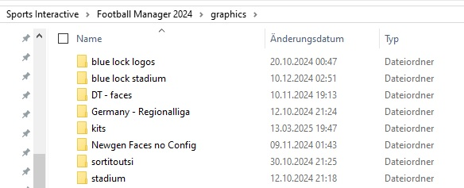
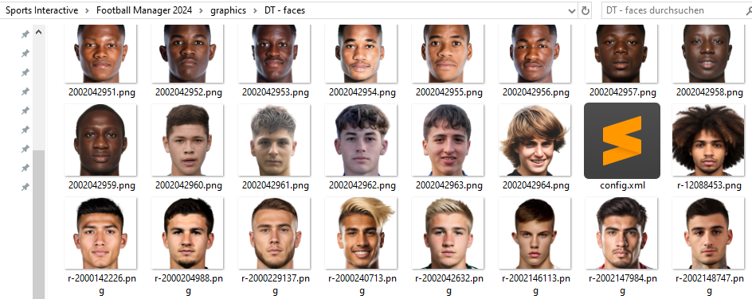
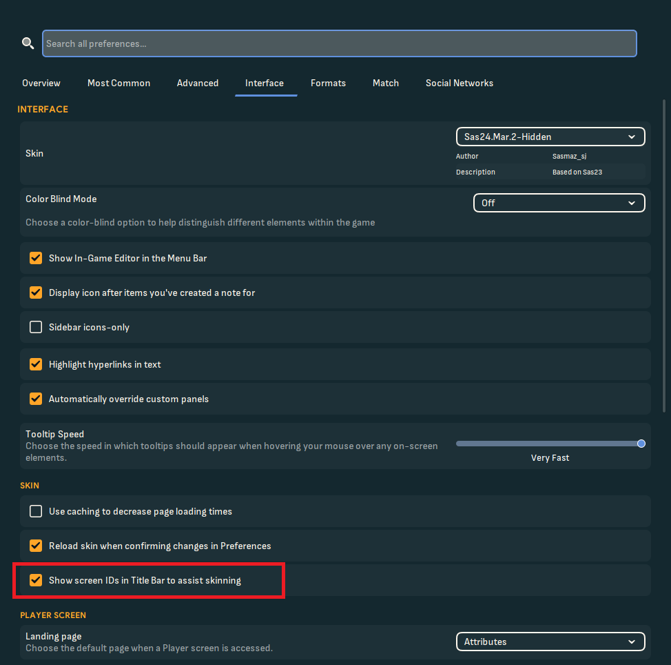

Facepacks sind eine großartige Möglichkeit, dein Football Manager 2024 Erlebnis zu verbessern, indem sie echte Bilder von Spielern, Mitarbeitern und anderen Charakteren im Spiel hinzufügen. Die Installation kann jedoch manchmal etwas knifflig sein. Wenn du Probleme hast, dein Facepack zum Laufen zu bringen, wird dich dieser Guide durch den Installationsprozess führen und bei der Behebung häufiger Probleme helfen.

## Wie man ein Facepack installiert

Die Installation eines Facepacks ist unkompliziert, wenn du diese Schritte befolgst:

1. Lade das Facepack herunter – Suche eine zuverlässige Quelle und lade die Zip-Datei mit dem Facepack herunter.
2. Sichere alte Dateien – Bevor du Änderungen vornimmst, solltest du deine bestehenden Facepack-Dateien sichern, falls du später wieder zurückwechseln möchtest.
3. Entpacke die Dateien – Entpacke die heruntergeladene Datei und verschiebe den Inhalt in deinen graphics-Ordner. Der Standardpfad unter Windows ist:

   _C:\Dokumente\Sports Interactive\Football Manager 2024\graphics_
   
   Wenn der Ordner nicht existiert, erstelle ihn manuell. Achte darauf, dass du tatsächlich nur einen Ordner hast, der ein Facepack enthält.
   Wenn das heruntergeladene Facepack keinen Ordner enthält, musst du einen erstellen. Nenne ihn zum Beispiel "facepack" und entpacke die PNGs sowie die config.xml dort hinein. Stelle sicher, dass sich dieser Ordner innerhalb des graphics-Ordners befindet.
   Ich empfehle nicht, mehrere Facepacks gleichzeitig zu laden. Wenn du sie kombinieren möchtest, gibt es weiter unten einen Guide dafür. 

4. Umgang mit bestehenden Facepacks – Wenn du bereits ein anderes Facepack installiert hast, musst du möglicherweise die vorhandenen PNG-Dateien überschreiben. Überschreibe jedoch nicht die config.xml, es sei denn, es ist notwendig.
5. Lade den Skin im FM neu – Öffne den Football Manager, gehe zu Einstellungen > Interface und lade den Skin neu. Stelle sicher, dass der Cache deaktiviert ist und "Skin neu laden, wenn Änderungen bestätigt werden" aktiviert ist. 
6. Stelle sicher, dass alles vorhanden ist – Der Ordner, den du erstellt hast, sollte nur PNGs und eine config.xml enthalten. Nichts anderes.

## Häufige Probleme und deren Lösungen

### Meine Spieler haben kein Gesicht

- Probleme mit der Bildgröße - Stelle sicher, dass die PNG-Dateien 250x250 Pixel groß sind, um die beste Anzeigequalität zu gewährleisten.
- Fehlende PNGs - Einige Facepacks enthalten möglicherweise nicht jeden Spieler, was zu leeren Stellen führt.
- Überprüfe die Spieler-IDs – Jeder Spieler hat eine einzigartige ID im Spiel. Um die richtige ID zu überprüfen:
- - Aktiviere die ID-Anzeige in den Spieleinstellungen. 
- - Klicke auf einen Spieler und notiere die ID in der Ecke.
- - Vergleiche sie mit dem Dateinamen des PNGs in deinem graphics-Ordner.
- PNG-Dateien umbenennen – Wenn die IDs nicht übereinstimmen, benenne die PNG-Dateien so um, dass sie der Spieler-ID entsprechen, und aktualisiere die config.xml entsprechend.

### Konflikte mit einem anderen Datensatz

Ein benutzerdefinierter Datensatz erstellt IDs für die Spieler, die er hinzufügt. Wenn du mehrere Datensätze verwendest, können diese den Spielern andere IDs zuweisen, als vom Ersteller ursprünglich vorgesehen. In diesem Fall musst du möglicherweise priorisieren, welchen Datensatz du verwenden möchtest, indem du Dateien umbenennst oder die config.xml anpasst. Wenn du dir wirklich die Arbeit machen möchtest, befolge diese Schritte, um sie zu kombinieren. Bitte lies zuerst alles hier durch, bevor du anfängst, insbesondere den Abschnitt "Tipps".

- Erstelle einen Ordner für jeden Datensatz – Entpacke die PNGs für jeden Datensatz in separate Ordner.
- Starte ein neues Spiel – Wähle die Datensätze aus, die du verwenden möchtest, und starte ein neues Spiel.
- Überprüfe die Spieler-IDs im Spiel – Du musst ihre geladenen IDs manuell herausfinden.
- Benenne die PNGs um – Benenne sie in ihre korrekten IDs um.
- Bearbeite die config.xml – Du musst die config.xml bearbeiten und die richtigen IDs entsprechend hinzufügen. Du benötigst nur eine config.xml. Mehrere sind möglich, wenn du mehrere Facepacks in mehreren Ordnern hast. Stelle nur sicher, dass sie sich nicht gegenseitig überschreiben.
- Kombiniere die Facepacks – Führe die PNGs aller Ordner zu einem zusammen. Stelle sicher, dass es keine überschneidenden IDs gibt. Wenn doch, musst du das PNG, das du behalten möchtest, zusammen mit dem zugehörigen Spieler löschen. Du musst das nicht tun, aber es ist der schnellste Weg, um Konflikte zu finden.

## Tipps zum Kombinieren von Facepacks

Hier sind einige hilfreiche Tipps, um den gesamten Prozess effizienter zu gestalten:

- Priorisiere den Datensatz - Die Datensätze laden in einer bestimmten Reihenfolge, von oben nach unten. Das bedeutet, dass der zuerst geladene Datensatz die eindeutigen IDs für seine Spieler beansprucht. Um sicherzustellen, dass ein Datensatz zuerst lädt, kannst du die .fmf-Datei umbenennen (z. B. mit einer (1) am Anfang). Dafür musst du jedoch den **Pre-Game Editor** verwenden. **Benenne die Datei nicht einfach im Ordner um**, das hat keinen Effekt. Einige Ersteller bieten dir vielleicht eine alternative Datensatz-Datei mit einem anderen Namen an, speziell für dieses Problem. Dies ist sinnvoll, wenn du einen größeren und einen kleineren Datensatz miteinander kombinieren möchtest, sodass du sicherstellen kannst, dass der kleinere Datensatz danach geladen wird. Das bedeutet, dass du weniger Spieler umbenennen musst.
- Die IDs behalten ihre Position und haben ein Muster – Zum Beispiel: Wenn du 2 Datensätze hast. Der erste fügt 50 Spieler hinzu und ihre IDs sind 1-50. Der zweite Datensatz enthält 10 Spieler mit den IDs 1-10. Du hättest 10 Konflikte. Aber da du weißt, welcher Datensatz zuerst geladen wird, kannst du davon ausgehen, dass die IDs für den zweiten Datensatz jetzt 51-60 sind. Stelle sicher, dass in keinem der Facepacks PNGs fehlen, und überprüfe zumindest die erste und letzte eindeutige ID für beide Datensätze, damit du das Muster anwenden kannst.
- Nutze fmXML, um eine neue config zu erstellen. Es ist wirklich unkompliziert. Stelle nur sicher, dass deine PNGs die richtigen Namen haben.

## Abschließende Gedanken

Facepacks können deinem Football Manager-Erlebnis eine neue Stufe der Immersion verleihen, aber ihre korrekte Einrichtung erfordert etwas Liebe zum Detail. Wenn du diese Schritte befolgst und häufige Probleme behebst, kannst du ein vollständig angepasstes Spiel mit den Gesichtern deiner Lieblingsspieler genießen.
Viel Spaß beim Managen!
