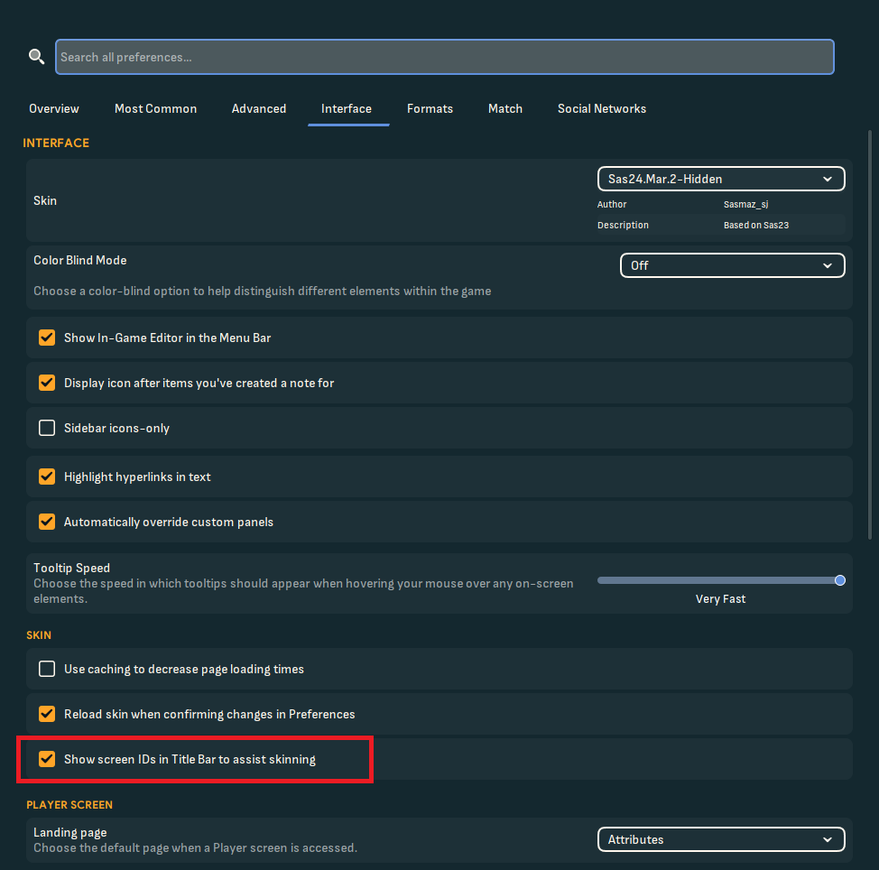

Face packs are a great way to enhance your Football Manager 2024 experience by adding real-life images of players, staff, and other in-game characters. However, installing them can sometimes be a bit tricky. If you're having trouble getting your face pack to work, this guide will walk you through the installation process and help troubleshoot common issues.

## How to install a face pack

Installing a face pack is straightforward if you follow these steps:

1. Download the face pack – Find a reliable source and download the zip file containing the face pack.
2. Backup old files – Before making changes, consider backing up your existing face pack files in case you want to revert later.
3. Extract the files – Unzip the downloaded file and move its contents to your graphics folder. The default location on Windows is:

   _C:\Documents\Sports Interactive\Football Manager 2024\graphics_
   
   If the folder doesn’t exist, create it manually. Make sure you actually have only one folder containing a face pack.
   If the downloaded face pack doesn’t come with a folder, you need to create one. Name it "facepack," for example, and extract the PNGs and the config.xml into it. Ensure this folder is inside the graphics folder.
   I don’t recommend loading multiple face packs at the same time. If you wish to combine them, there is a guide further below. 

4. Managing existing face packs – If you already have a different face pack installed, you may need to overwrite the existing PNG files. However, do not overwrite the config.xml file unless necessary.
5. Reload the skin in FM – Open Football Manager, go to Preferences > Interface, and reload the skin. Make sure caching is disabled and "Reload skin when confirming changes" is enabled. 
6. Ensure all content is there – The folder you have created should only contain PNGs and a config.xml. Nothing else.

## Common issues and how to fix them

### My players have no face

- Image size issues - Ensure that the PNG files are 250x250 pixels for the best display quality.
- Missing PNGs - Some face packs may not include every player, leading to blank spots.
- Check player IDs – Every player has a unique ID in the game. To verify the correct ID:
- - Enable ID display in the game settings. 
- - Click on a player and note the ID in the corner.
- - Compare it to the PNG file name in your graphics folder.
- Rename PNG files – If the IDs don’t match, rename the PNG files to match the player’s ID and update config.xml accordingly.

### conflict with another dataset

A custom dataset will create IDs for the players it adds. If you are using multiple datasets, they may assign different IDs to players, than originally intented by the creator. In this case, you may need to prioritize which dataset you want to use by renaming files or adjusting the config.xml file. If you really want to put in the work, follow these steps to combine them. Please read everything here first before actually starting, especially the Tip section.

- Create a folder for every dataset – Extract the PNGs for each dataset into separate folders.
- Start a new game – Select the datasets you want to use and start a new game.
- Check the player IDs in-game – You have to manually figure out their loaded IDs.
- Rename the PNGs – Rename them to their correct IDs.
- Edit the config.xml – You have to edit the config.xml and add the correct IDs accordingly. You only need one config.xml, multiple are possible, if you have multiple face packs in multiple folders. Make sure they don't overwrite each other.
- Combine the face packs – Merge the PNGs of all folders into one. Ensure they have no overlapping IDs. If they do, you will have to delete the PNG you might want to keep along with the associated player. You don't have to do this, but it's the fastest way to find conflicts.

## Tips for combining face packs

Here are some helpful tips, to make the whole process more efficient.

- Prioritize the dataset - The datasets load in a specific order, from top to bottom. That means, that the first loaded dataset, will claim the unique IDs for its players. To ensure a dataset loads first, you can rename the .fmf file with a (1) for example at the beginning, but you need to use the **pre-game-editor** for this. **Do not rename the file in the folder** This will have no effect. Some creators might offer you a different dataset file, if you are playing a custom dataset, with a different name fort this particular problem. This makes sense, if you want to combine a bigger and a tinier dataset which each other, so you can make sure, the tinier dataset will be loaded after. That means, you have to rename less players.
- The IDs will keep their position and have a pattern – For example, if you have 2 datasets. The first one adds 50 players and their IDs are 1-50 and the second dataset includes 10 players with their ID 1-10. You would have 10 conflicts. But because you know which dataset is loaded first, you can assume, the IDs for the second dataset is now 51-60. Make sure, that there are no missing PNGs in either of the face packs and also check at least the first and last unique ID for the both datasets, so you can apply the pattern.
- Use fmXML for creating a new config. It’s really straight forward. Just make sure, your PNGs have the correct names.

## Final thoughts

Face packs can add a new level of immersion to your Football Manager experience, but setting them up correctly requires attention to detail. By following these steps and troubleshooting common issues, you can enjoy a fully customized game with the faces of your favorite players.
Happy managing!
