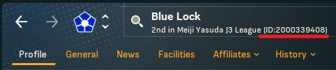
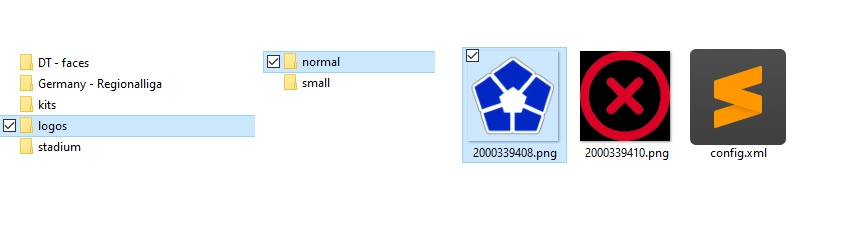
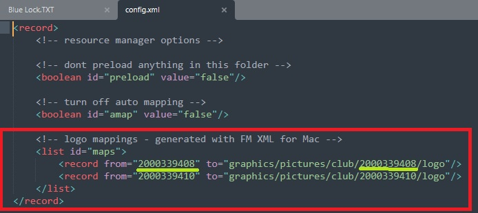
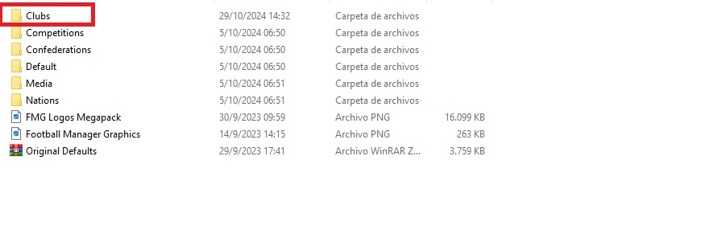

Dieser Guide wird dir helfen, Logos für den Football Manager 24 zu installieren. Nicht jedes Logo ist im FM24 lizenziert und dieser Guide wird dir dabei helfen, mehr Immersion in dein Spiel zu bringen. Ich werde auch erklären, wie man die config.xml ändert und Lösungen für Probleme aufzeigen, auf die ich gestoßen bin.

## Wie man installiert

1. Lade die logos.zip herunter, die du verwenden möchtest.
2. Finde deinen graphics-Ordner. Unter Windows befindet er sich meistens hier:

_C:\Dokumente\Sports Interactive\Football Manager 2024\graphics_

Es sollte ungefähr so aussehen: 
Wenn du keinen graphics-Ordner hast, musst du ihn erstellen.

3. Entpacke die Zip-Datei. Möglicherweise benötigst du dafür 7-Zip (ein kostenloses Programm). Öffne einfach die Zip-Datei und verschiebe den gesamten Inhalt in den graphics-Ordner.
4. Nun müssen wir unsere Dateien laden:
   Gehe im Spiel auf Einstellungen -> Interface -> stelle sicher, dass der Cache deaktiviert ist -> Skin neu laden 

Lade einen Spielstand und schau, ob es funktioniert. Wenn ja, viel Spaß!

## Wie man Probleme behebt

Wenn es nicht funktioniert, müssen wir vielleicht etwas Feintuning betreiben. Das liegt entweder daran, dass du andere Logos installiert hast, oder dass andere Teams geladen sind, die diese "einzigartige" ID beanspruchen. Wenn du bereits andere Logos installiert hast, solltest du vielleicht mit [Schritt 12](#schritt-12) beginnen.

<a id="schritt-5"></a>

5. Lade dein Spiel und überprüfe die IDs der Teams. Ich werde Blue Lock aus meinem eigenen Datensatz als Beispiel verwenden. Aktiviere dafür "Zeige Screen-IDs in der Titelleiste" in den Einstellungen. 
6. Lade einen Spielstand und klicke auf das Blue Lock Team. Du solltest nun die ID in der oberen Ecke sehen. 
7. Öffne deinen graphics-Ordner und vergleiche die IDs meiner Dateien mit dieser ID.
   Wie du sehen kannst, ist sie in meinem Fall korrekt. Die ID im Spiel ist dieselbe wie auf dem PNG. 
8. Wenn sie nicht übereinstimmen, musst du das PNG-Bild in die ID umbenennen, die im Spiel angezeigt wird.

<a id="schritt-9"></a>

9. Du musst auch die config.xml öffnen und die ID ändern. Es ist wichtig, die ID zweimal umzubenennen. Ich habe beide Zahlen markiert, die du in der config ändern musst.

Beispiel-Config für Normal:

```xml
<record>
    <boolean id="preload" value="false"/>
    <boolean id="amap" value="false"/>
    <list id="maps">
        <record from="2000339408" to="graphics/pictures/club/2000339408/logo"/>   
    </list>
</record>
```

Beispiel-Config für Small:

```xml
<record>
    <boolean id="preload" value="false"/>
    <boolean id="amap" value="false"/>
    <list id="maps">
        <record from="2000339408" to="graphics/pictures/club/2000339408/icon"/>   
    </list>
</record>
```



10. Du musst das für beide Ordner tun. Für "normal" und "small". **Achte darauf, die richtige Bildgröße zu verwenden.**
11. Nun müssen wir unsere Dateien neu laden:
    Gehe im Spiel auf Einstellungen -> Interface -> stelle sicher, dass der Cache deaktiviert ist -> Skin neu laden 

<a id="schritt-12"></a>

12. Wenn es immer noch nicht funktioniert, könnte es an anderen Logos liegen, die du installiert hast.
    Öffne den Ordner, in dem sich die anderen Logos befinden. Wenn er eine andere Dateistruktur hat als meiner, suche nach dem "clubs"-Ordner. 
13. In diesem Ordner solltest du die Unterordner "small" und "normal" finden. Öffne nacheinander beide Ordner und platziere dort nur die PNGs für die Logos und Icons, die du ersetzen möchtest. Nicht die config.xml! Wiederhole nun [Schritt 5](#schritt-5) bis Schritt 8. Möglicherweise musst du bestimmte PNGs ersetzen, wenn sie dieselbe ID verwenden. Stelle sicher, dass du die ID im Spiel überprüfst ([Schritt 5](#schritt-5)), bevor du etwas ersetzt. Außerdem solltest du Kopien von Dateien anlegen, die du nicht verlieren möchtest.
14. Du solltest nun einen Ordner voller PNGs mit den richtigen IDs und einer alten config haben. Kopiere die config.xml zur Sicherheit auf deinen Desktop, falls du etwas kaputt machst. Nun musst du nur noch die alte config.xml bearbeiten. Öffne sie und ändere die ID, (wie in [Schritt 9](#schritt-9) beschrieben) zu der ID im Spiel und füge sie in die Liste ein.

Im "normal"-Ordner:

```xml
<record from="2000339408" to="graphics/pictures/club/2000339408/logo"/>
```

Im "small"-Ordner:

```xml
<record from="2000339408" to="graphics/pictures/club/2000339408/icon"/>
```

Kopiere diese Zeile und ändere die Zahlen zur Unique ID deiner Dateien. Platziere sie in der Liste (`<list id="maps">`).
Deine config.xml wird dadurch sehr viel größer sein. Du kannst den Eintrag jedoch überall in diese Liste setzen. Ich empfehle, ihn ganz oben oder unten in der Liste zu platzieren, falls du ihn noch einmal ändern oder löschen musst.

Beispiel-Config für Normal:

```xml
<record>
    <boolean id="preload" value="false"/>
    <boolean id="amap" value="false"/>
    <list id="maps">
        <record from="2000339408" to="graphics/pictures/club/2000339408/logo"/>   
    </list>
</record>
```

15. Diesen Prozess musst du sowohl für den "small"- als auch für den "normal"-Ordner durchführen. Es reicht jedoch in der Regel aus, die neuen Zeilen in deine config.xml zu kopieren und das Wort "logo" in "icon" umzuwandeln (oder umgekehrt). Dann musst du nur noch die PNGs platzieren und umbenennen.
16. Jetzt laden wir unsere Dateien ein letztes Mal neu:
    Gehe im Spiel auf Einstellungen -> Interface -> stelle sicher, dass der Cache deaktiviert ist -> Skin neu laden !Screenshot

## Abschließende Gedanken

Das sollte alles abdecken. Das Verwalten der config.xml kann etwas mühsam sein. Achte einfach darauf, immer die richtigen IDs und Dateigrößen zu verwenden.
