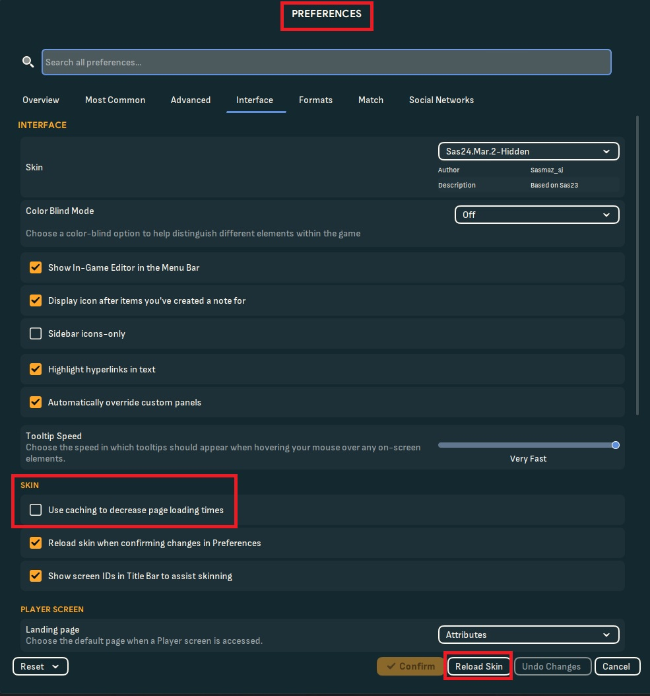

This guide will help you, to install logos for Football Manager 24. Not every logo is licensed in FM24 and this guide will help you to bring more immersion into your game. I will also explain, how to change the config.xml and fixes for problems I have encountered.

## How to install

1. Download the logos.zip you want to use
2. You should locate your graphics folder. In Windows it is most likely located in:

_C:\Documents\Sports Interactive\Football Manager 2024\graphics_

It should look similar to this. 
If you don't have any graphics folder, you need to create it.

3. Unzip the Zip file. You might need 7 Zip for it. It's a free program. Just open the Zip file and move all the content in the graphics folder.
4. Now we need to load our files:
   Go in game -> open Preferences -> Interface -> make sure use caching is disabled -> reload 

Load up a save and see if it works. If it does, have fun! :)

## How to fix problems

If it doesn't work, we might have to do some fine-tuning. That is either, because you have other logos installed, or, because you have other teams loaded, that claim the "unique" ID. If you have other logos installed, you might want to start with [Step 12](#step-12).

<a id="step-5"></a>

5. Load up your game and check if the IDs of the teams. I will use Blue Lock from my custom dataset as an example. To do so, Enable Show screen ID in Title Bar. 
6. Load up a save and click on the Blue Lock Team. You should now see the ID in the left corner. 
7. Open up your graphics folder and compare the IDs of my files with this ID.
   As you can see, in my case that is correct. The ID in game is the same as the PNG. 
8. If that isn't correct, you have to rename the PNG image, to the ID in game.

<a id="step-9"></a>

9. You also have to open up the config.xml and change the ID name. It is important, to rename the ID twice. I marked both numbers, you have to change in the config.

example config for normal:

```xml
<record>
    <boolean id="preload" value="false"/>
    <boolean id="amap" value="false"/>
    <list id="maps">
        <record from="2000339408" to="graphics/pictures/club/2000339408/logo"/>   
    </list>
</record>
```

example config for small

```xml
<record>
    <boolean id="preload" value="false"/>
    <boolean id="amap" value="false"/>
    <list id="maps">
        <record from="2000339408" to="graphics/pictures/club/2000339408/icon"/>   
    </list>
</record>
```


10. You also need to that for both folders. For normal and small. **Make sure to use the correct picture size.**
11. Now we need to load our files:
    Go in game -> open Preferences -> Interface -> make sure use caching is disabled -> reload 

<a id="step-12"></a>

12. If it still doesn't work, it might be because of other logos you have installed.
    Open up the folder, where the other logos are located. If it has a different file structure than mine, try to look for the "clubs" folder. 
13. In that folder, you should find the folders small and normal. Open up either of them and place only the PNGs for themy logos and icons in there that you want to replace. Not the config.xml! Repeat now [Step 5](#step-5) to Step 8. You might need to replace certain PNGs, if they share the same ID. Make sure to check the in game ID [Step 5](#step-5) before you replace anything. Also, you should make copies of things, you don't want to lose.
14. You should now have a folder full of PNGs, with the right IDs and an old config. Copy the config.xml to your desktop, in case you break something. Now you just need to edit the old config.xml. Open it up and change the ID, I have described that in [Step 9](#step-9), to the in game ID and paste it in the list.

In normal folder:

```xml
<record from="2000339408" to="graphics/pictures/club/2000339408/logo"/>
```

In small folder:

```xml
<record from="2000339408" to="graphics/pictures/club/2000339408/icon"/>
```

Copy this line and change the numbers to the Unique ID of your files. Place it in list.
Your config.xml will be a lot bigger. But you can put it anywhere in that list. I would recommend putting it on top or bottom of your list, in case you have to change or delete them.

example config for normal:

```xml
<record>
    <boolean id="preload" value="false"/>
    <boolean id="amap" value="false"/>
    <list id="maps">
        <record from="2000339408" to="graphics/pictures/club/2000339408/logo"/>   
    </list>
</record>
```

15. You have to do the same process for the small and normal folder. However, it should be fine, to just copy the new lines in your config.xml and change the word logo to icon, or the other way around. Then you just need to place the PNGs and rename them.
16. Now we need to load our files for the last time:
    Go in game -> open Preferences -> Interface -> make sure use caching is disabled -> reload 

## Final thoughts

That should cover everything. Config.xml managing can be tedious. Make sure not to always use the right IDs and file sizes.
