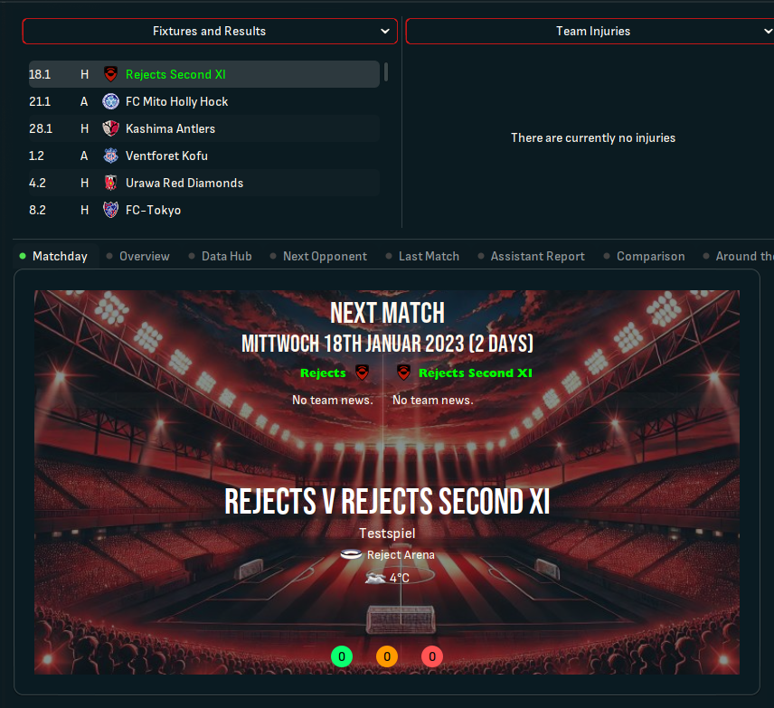
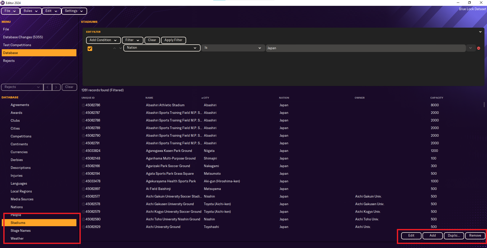
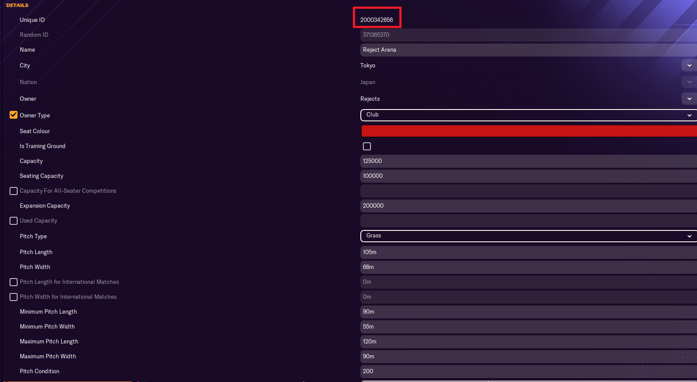
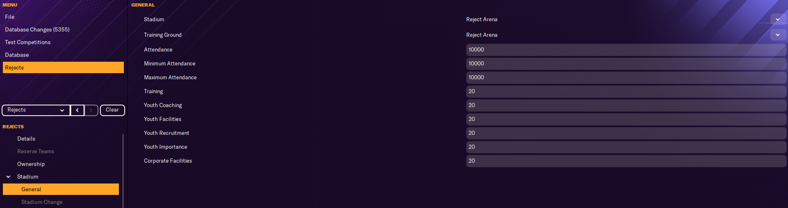
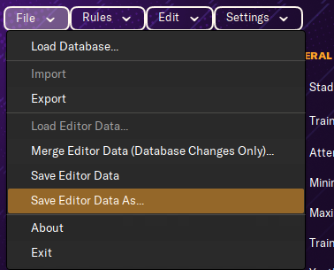
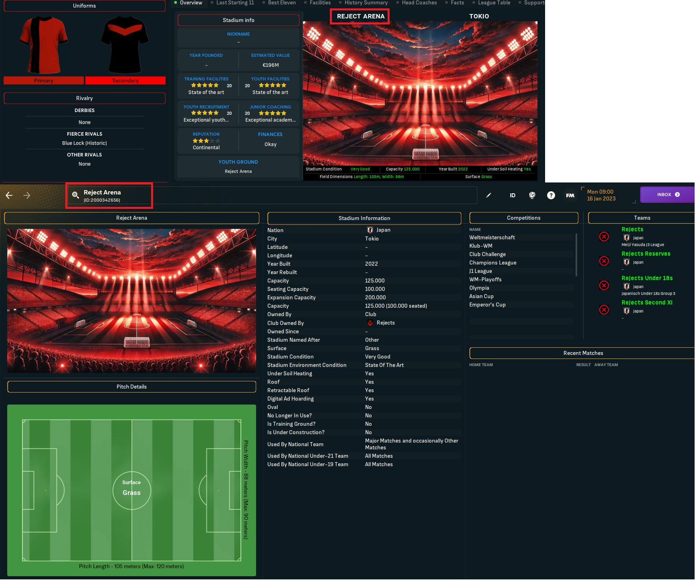
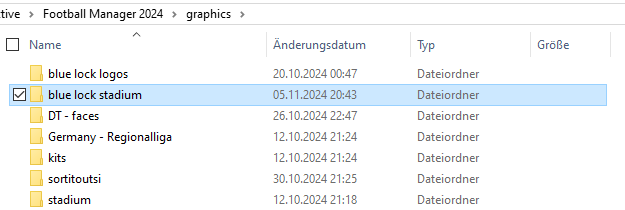
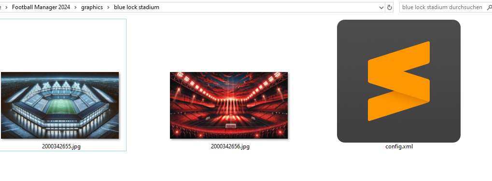
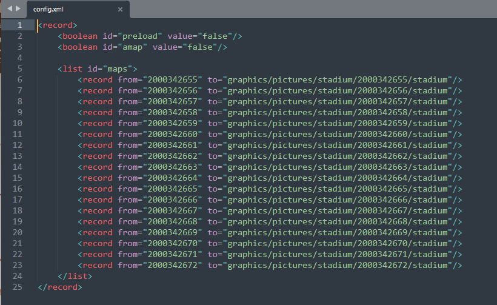
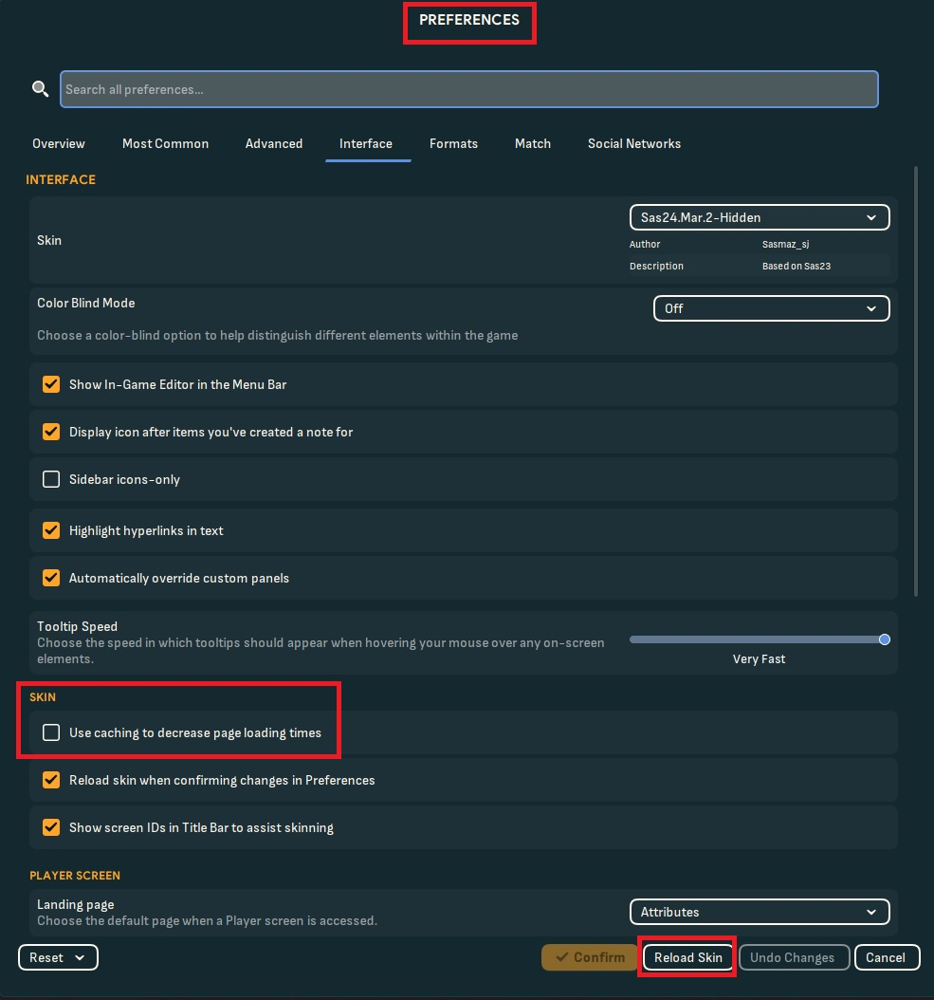

Hast du dich jemals gefragt, wie du im FM24 ein eigenes Stadionbild für dein Team oder sogar ein komplett selbsterstelltes Team bekommen kannst? Dann musst du nicht weiter suchen. Ich bin hier, um dir zu zeigen, wie das geht! Ich werde das Team "Rejects" aus meinem Blue Lock Datensatz als Beispiel verwenden, aber das funktioniert für jedes Team.
Hier ist ein Beispiel, wie es aussehen könnte:


## Schritt 1. - Vorbereitung

Was wir benötigen:

- Pre Game Editor, falls du ein komplett neues Stadion erstellen möchtest.
- Ein .jpg des Stadions, die Größe sollte 800 x 480 Pixel nicht überschreiten.
- Einen Skin, der das Stadion anzeigen kann. Ich benutze Sas.

Nun, das ist im Grunde alles.

## Schritt 2. – Ein Stadion erstellen

Dieser Schritt ist nur wichtig, wenn du ein neues Stadion erstellen willst. Wenn du einfach das Bild eines existierenden Stadions ersetzen möchtest, kannst du dies überspringen.

Starte den Pre Game Editor. Lade den Datensatz, den du bearbeiten möchtest, und gehe zu „Stadien“. Du kannst entweder ein Stadion von hier kopieren oder ein neues erstellen. 
Hier kannst du alles an deinem Stadion ändern, was du möchtest. Fühle dich frei, zu experimentieren. Der wichtige Teil in diesem Fenster ist die eindeutige ID (Unique ID). Diese musst du dir notieren. 

In meinem Fall ist das die 2000342656.

Wir müssen nun auch dieses Stadion für den gewünschten Verein auswählen.
Gehe also zu „Vereine“ und suche nach deinem Team. In meinem Fall ist es „Rejects“. ![Screenshot ]](../../assets/images/FootballManager/stadiumguide4.png)
Klicke auf Bearbeiten und gehe zu Stadion.  Dort musst du das Stadion auf das ändern, welches du gerade erstellt hast. In meinem Fall ist es die Rejects Arena.
Speichere den Datensatz.


## Schritt 3. - Dateistruktur

Lass uns nun zum etwas komplizierteren Teil kommen. Die Dateien in den richtigen Ordner packen und die config.xml erstellen.

Was wir brauchen:

- das .jpg in 800 x 480 Pixeln oder kleiner
- die einzigartige ID (Unique ID) des Stadions.

Woher bekommen wir die Unique ID?
Entweder aus dem Pre Game Editor, wie ich es vorhin gezeigt habe, oder im Spiel, wenn du "Zeige Screen-IDs in der Titelleiste zur Fehlerbehebung" aktiviert hast.  

Okay, fangen wir an.
Gehe zu deinem graphics-Ordner. Wenn du keinen hast, musst du ihn erstellen. Er befindet sich meistens unter:
**C:\Dokumente\Sports Interactive\Football Manager 2024\graphics**

Erstelle einen Ordner. Du kannst ihn nennen, wie du willst. Ich würde empfehlen, ihn ganz einfach stadiums zu nennen. 
Öffne den Ordner und verschiebe das .jpg dorthin. Benenne das .jpg in die Unique ID um. In meinem Fall ist das 2000342656. Dein Ordner sollte nun ungefähr so aussehen: 

Erstelle nun eine Datei und nenne sie _config.xml_.
Öffne die Datei und kopiere diesen Code hinein:

```xml
<record>
    <boolean id="preload" value="false"/>
    <boolean id="amap" value="false"/>
    <list id="maps">
        <record from="UNIQUE ID" to="graphics/pictures/stadium/UNIQUE ID/stadium"/> 
        <record from="UNIQUE ID2" to="graphics/pictures/stadium/UNIQUE ID2/stadium"/>   
    </list>
</record>
```

Replace **UNIQUE ID** with the correct ID. You can add multiple stadiums at the same time. Delete the 2nd record, if you only want to add a singular stadium. If you have want to add more than 2, just add more lines with the same pattern.



## Step 4. – Reload Skin

Now you need to load your files in game:

Go in game -> open Preferences -> Interface -> make sure use caching is disabled -> reload


If you have a custom stadium or a custom team, make sure, to enable the Dataset when you start a new career.  

## Problems

Unfortunately, the 3D Model of the stadium might look not as good as expected, if you create a new stadium. You can't really choose what stadium you want and how it looks like.
If your stadium has gaps, it means you can upgrade it. So for example:
My stadium has 100000 seats. I can upgrade it to 200000. That means, that half of your stadium is not build and it will create gaps. Maybe some other setting could also influence this.

Now everything should work. Let me know if you encounter any problem! Have a great day and enjoy playing!
