Have you ever wondered: How you can get your own Stadium Picture in FM24 for your team or even a custom Team? Well, you don’t have to look further. I am here to show you how it’s done! I will use Team Rejects from my Blue Lock Dataset as an example, but it will work for every team.
Here is an example of how it could look like.
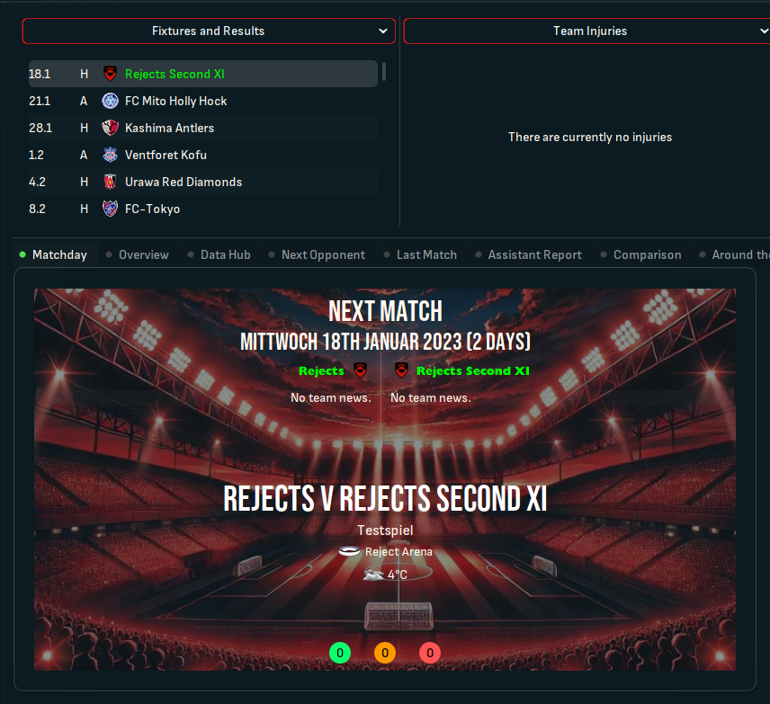

## Step 1. - Preparation

What do we need:

- Pre Game Editor, if you want to create a complete new Stadium.
- A .jpg of the Stadium, the size shouldn’t be above 800 x 480 pixels.
- A skin, that is able to show the stadium. I’m using Sas.

Well, that is basically everything.

## Step 2. – Create a stadium

This step is only important, if you want to create a new stadium. If you just want to replace the picture of an existing stadium, you can skip this.

Start the Pre Game Editor. Load up the dataset you want to edit and go to “Stadiums”. Either you can copy a stadium from here, or you can create a new one. 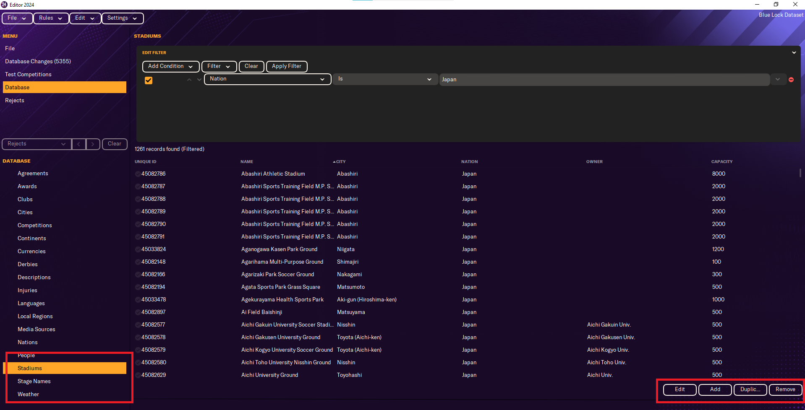
Here you can change everything you want about your stadium. Feel free to experiment. The important part in that window is the unique ID. You have to write that down. 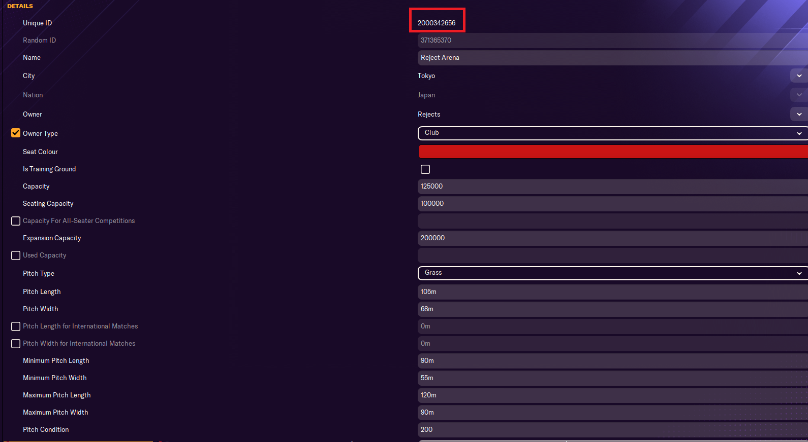

In my case it is 2000342656.

We also have to choose this stadium for the club you want to use.
So, go to “Clubs” and look for the team. In my case, it is “Rejects”. 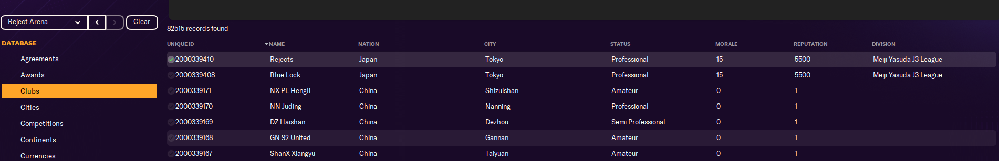
Press Edit and go to Stadium. 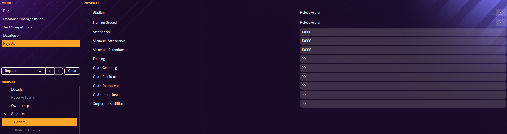 There you have to change the stadium to the one you just created. In my case, it’s Rejects Arena.
Save the dataset.
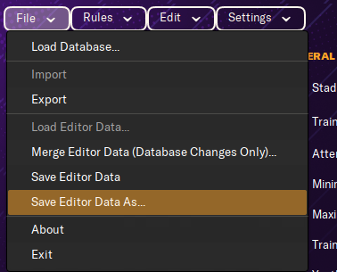

## Step 3. -  File Structure

So, now let’s do the slightly complicated part. Putting the files in the right folder and do the config.xml.

What do we need?

- the .jpg 800 x 480 pixels or tinier
- the unique ID for the stadium.

Where do we get the unique ID from?
Either the Pre Game Editor, as I have shown before, or in game , if you enabled “Show unique IDs in header”. 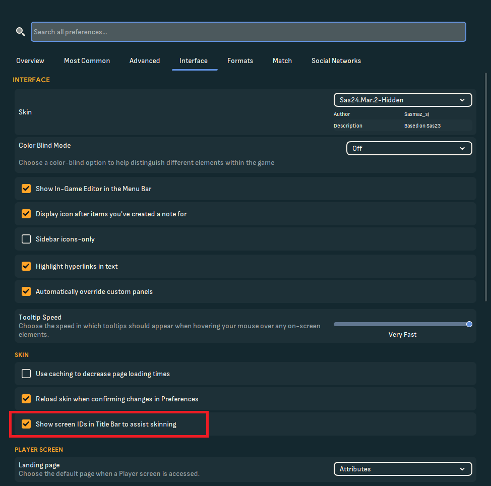 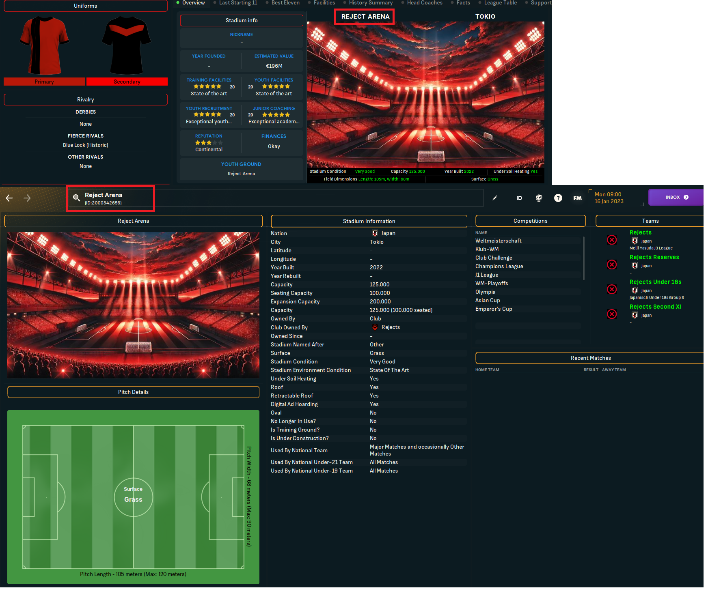

Okay, let’s start.
Go to your graphics folder, if you don’t have one, you need to create it. It’s most likely located in:
**C:\Documents\Sports Interactive\Football Manager 2024\graphics**

Create a folder. You can call it whatever you want. I would recommend to call it something simple stadiums. 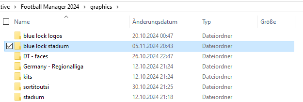
Open the folder and move the .jpg to it. Rename the .jpg to the unique ID.  In my case it is 2000342656. Your folder should now look similar to this. 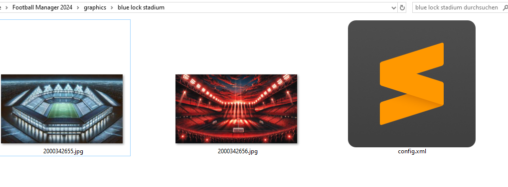

Now create a file and call it _config.xml_.
Open the file and copy this code in there.

```xml
<record>
    <boolean id="preload" value="false"/>
    <boolean id="amap" value="false"/>
    <list id="maps">
        <record from="UNIQUE ID" to="graphics/pictures/stadium/UNIQUE ID/stadium"/> 
        <record from="UNIQUE ID2" to="graphics/pictures/stadium/UNIQUE ID2/stadium"/>   
    </list>
</record>
```

Replace **UNIQUE ID** with the correct ID. You can add multiple stadiums at the same time. Delete the 2nd record, if you only want to add a singular stadium. If you have want to add more than 2, just add more lines with the same pattern.

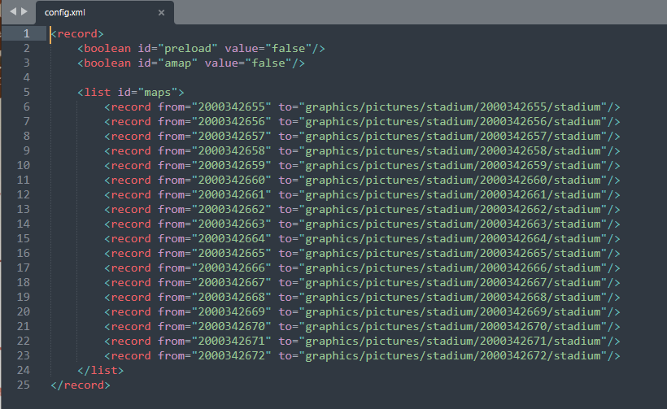

## Step 4. – Reload Skin

Now you need to load your files in game:

Go in game -> open Preferences -> Interface -> make sure use caching is disabled -> reload
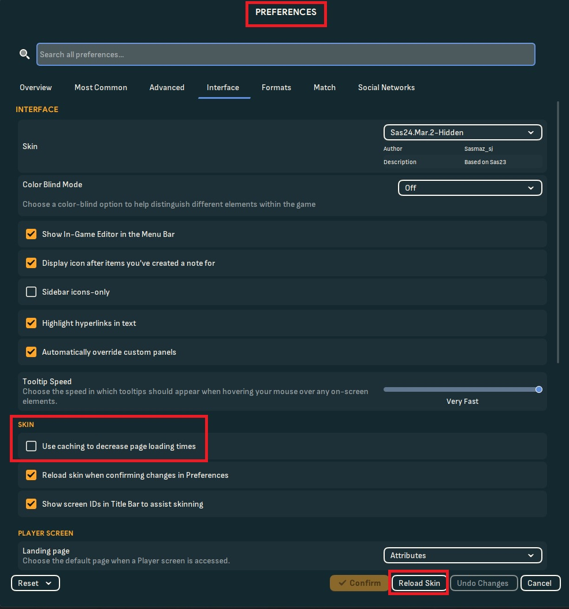

If you have a custom stadium or a custom team, make sure, to enable the Dataset when you start a new career.  

## Problems

Unfortunately, the 3D Model of the stadium might look not as good as expected, if you create a new stadium. You can't really choose what stadium you want and how it looks like.
If your stadium has gaps, it means you can upgrade it. So for example:
My stadium has 100000 seats. I can upgrade it to 200000. That means, that half of your stadium is not build and it will create gaps. Maybe some other setting could also influence this.

Now everything should work. Let me know if you encounter any problem! Have a great day and enjoy playing!
